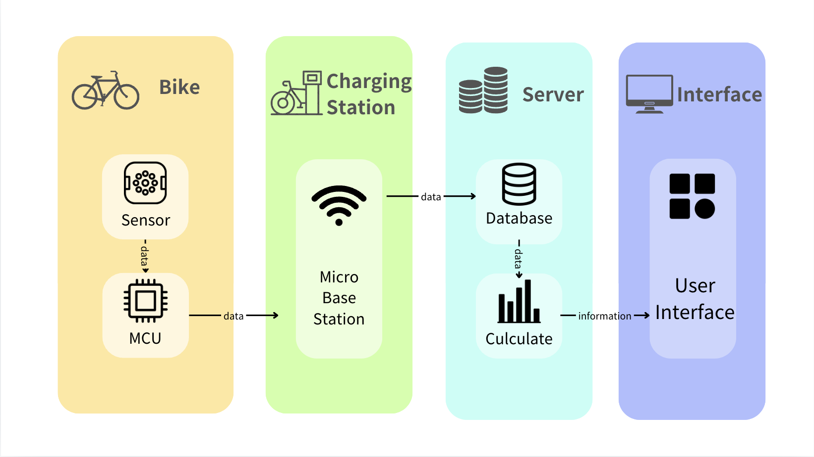
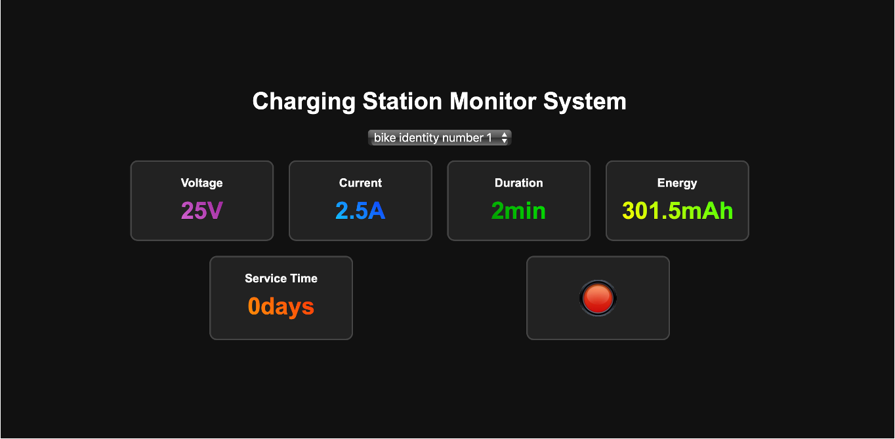
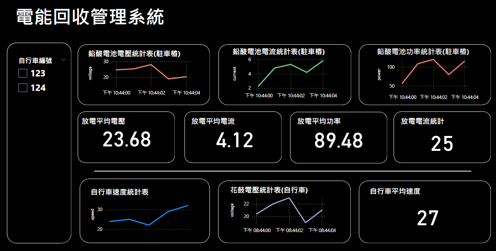
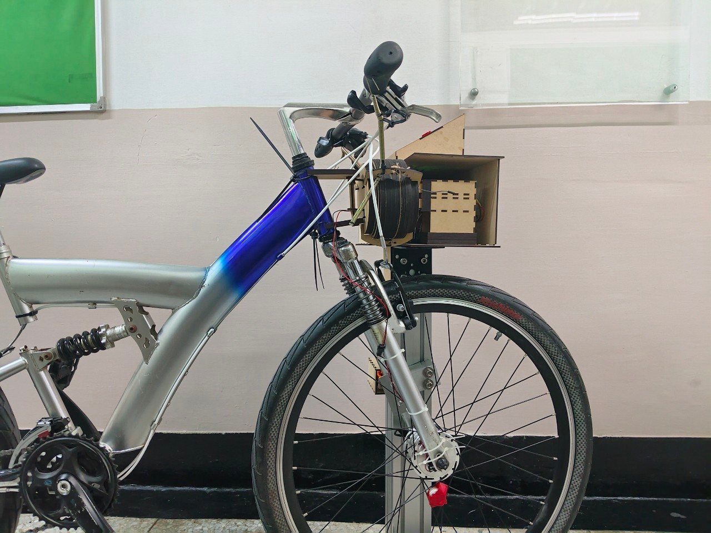
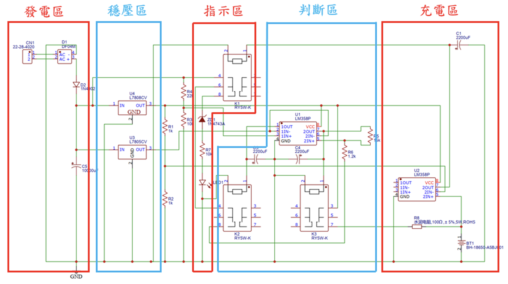
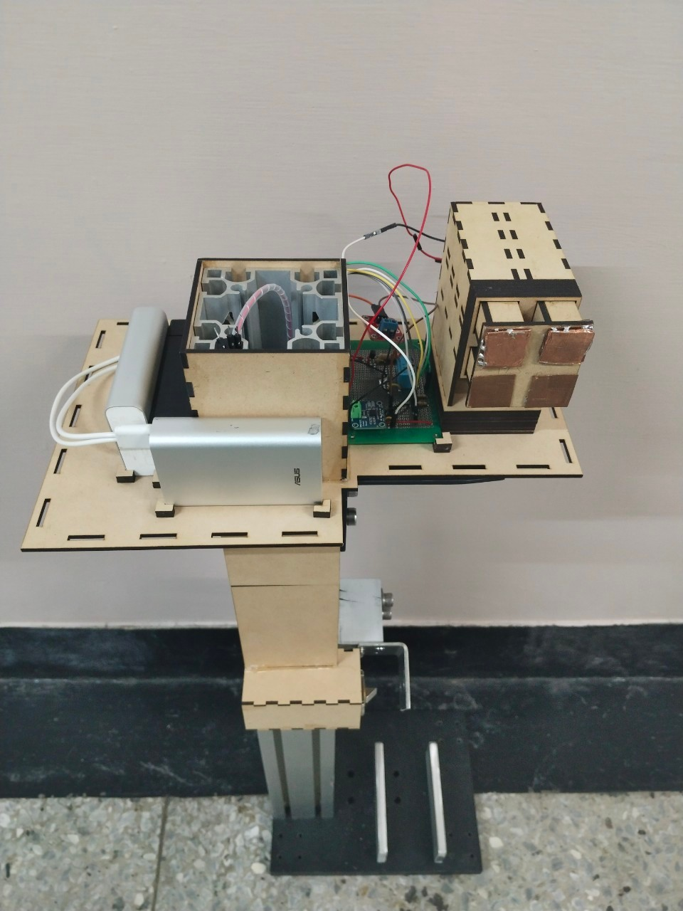

# IoT System for Public Bicycle Energy Recovery

This project, **IoT System for Public Bicycle Energy Recovery**, is designed to track and analyze data from a public bicycle energy recovery system. By collecting and uploading data to an AWS server database, the system allows for real-time monitoring through a webpage, with detailed analytics available in Power BI.
### System Architecture

## Project Overview

This IoT system uses an MCU programmed in C to control energy recovery from bicycles equipped with a hub generator. The system comprises three primary components:

1. **Bike Node**: Generates energy while riding and stores it in a lithium-ion battery.
2. **Charging Station Node**: Measures the bike’s battery voltage upon docking and discharges energy to a lead-acid battery if a set threshold is met.
3. **Backend Management Interface**: Allows administrators to monitor bike battery status, discharge time, and total energy at the charging station, facilitating insights into ride distance, energy production, and usage trends.
### Real-Time Monitoring Webpage (Charging Station)

### Power BI Statistical Dashboard

## System Architecture

### Bike Node
- Generates electricity via a hub generator during rides.
- Stores energy in a lithium-ion battery after passing through a rectifier, comparator circuits, and capacitors.
- Logs ride data (speed, voltage, time) on an SD card and uploads it to the cloud when docked.
- ### Appearance

- ### Energy Harvesting Circuit Architecture

- ### Performance Analysis
- The graph demonstrates the circuit's dual-threshold hysteresis mechanism, which triggers a stable 23.5V charging output only when the specific speed threshold is met, effectively preventing oscillation.

### Charging Station Node
- Monitors bike battery discharge status, including voltage, current, and time, upon docking.
- Controls energy flow to a lead-acid battery based on set voltage thresholds.
- Receives control signals from the backend interface for interrupting energy recovery as needed.
- ### Charging Station Internal Structure

### Backend Management
- Displays real-time data on energy recovery, discharge status, and ride data.
- Allows administrators to analyze data for peak usage times and refine energy recovery strategies for efficient resource allocation.

## Repository Structure

- **Bike**: Program for the bike MCU, responsible for storing ride data on the SD card and uploading it to the cloud upon docking.
- **ChargingStation**: Program for the charging station MCU, monitors battery discharge status and logs relevant metrics.
- **ChargingStationMonitor.html**: Real-time monitoring webpage for the charging station end.
- **fetch_data.php**: PHP script that fetches database data for real-time monitoring on the webpage.
- **ChargingStationUpload.php**: API endpoint that receives data from the charging station MCU.
- **BikeUpload.php**: API endpoint that receives data from the bike MCU.
- **ChargingStationLockAndDisplay**: Program for the charging station locker and lcd display, illustrate status information.

## Technologies Used

- **Languages**: C++ (MCU programming), PHP (API development), HTML (frontend)
- **Protocols**: SPI, I2C, Wi-Fi
- **Platforms**: AWS (cloud database)
- **Tools**: Power BI (data analytics)

## Installation and Setup

1. **Microcontroller Setup**:
   - Flash the `Bike.cpp` program to the bike MCU and the `ChargingStation.cpp` program to the charging station MCU.
   - Set up the necessary sensors and components on the bike and station for voltage and current measurement.

2. **Web and Database Setup**:
   - Deploy the PHP files on an AWS server to handle data upload and retrieval.
   - Configure the Power BI dashboard with the cloud database for advanced analytics.

3. **Monitoring Interface**:
   - Open `ChargingStationMonitor.html` in a browser to access real-time data from the charging station.

## Usage

Once deployed, the system operates as follows:
- **Bike**: Logs and uploads ride data when docked.
- **Charging Station**: Continuously monitors energy metrics and uploads them to the server.
- **Backend Interface**: Allows for real-time and historical analysis of energy recovery data.
